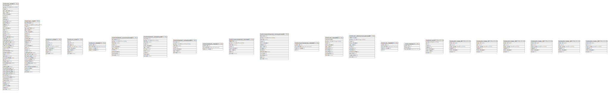

# tarmo

## Tables

| Name | Columns | Comment | Type |
| ---- | ------- | ------- | ---- |
| [kooste.lipas_pisteet](kooste.lipas_pisteet.md) | 49 |  | BASE TABLE |
| [kooste.lipas_viivat](kooste.lipas_viivat.md) | 29 |  | BASE TABLE |
| [kooste.osm_pisteet](kooste.osm_pisteet.md) | 8 |  | BASE TABLE |
| [kooste.osm_alueet](kooste.osm_alueet.md) | 8 |  | BASE TABLE |
| [kooste.osm_metadata](kooste.osm_metadata.md) | 4 |  | BASE TABLE |
| [kooste.tamperewfs_luonnonmuistomerkit](kooste.tamperewfs_luonnonmuistomerkit.md) | 10 |  | BASE TABLE |
| [kooste.tamperewfs_luontopolkurastit](kooste.tamperewfs_luontopolkurastit.md) | 11 |  | BASE TABLE |
| [kooste.tamperewfs_luontopolkureitit](kooste.tamperewfs_luontopolkureitit.md) | 7 |  | BASE TABLE |
| [kooste.tamperewfs_metadata](kooste.tamperewfs_metadata.md) | 3 |  | BASE TABLE |
| [kooste.museovirastoarcrest_rkykohteet](kooste.museovirastoarcrest_rkykohteet.md) | 8 |  | BASE TABLE |
| [kooste.museovirastoarcrest_muinaisjaannokset](kooste.museovirastoarcrest_muinaisjaannokset.md) | 14 |  | BASE TABLE |
| [kooste.museovirastoarcrest_metadata](kooste.museovirastoarcrest_metadata.md) | 4 |  | BASE TABLE |
| [kooste.syke_natura2000](kooste.syke_natura2000.md) | 10 |  | BASE TABLE |
| [kooste.syke_valtionluonnonsuojelualueet](kooste.syke_valtionluonnonsuojelualueet.md) | 12 |  | BASE TABLE |
| [kooste.syke_metadata](kooste.syke_metadata.md) | 4 |  | BASE TABLE |
| [kooste.metadata](kooste.metadata.md) | 3 |  | BASE TABLE |
| [kooste.all_points](kooste.all_points.md) | 7 |  | MATERIALIZED VIEW |
| [kooste.point_clusters_8](kooste.point_clusters_8.md) | 6 |  | MATERIALIZED VIEW |
| [kooste.point_clusters_9](kooste.point_clusters_9.md) | 6 |  | MATERIALIZED VIEW |
| [kooste.point_clusters_10](kooste.point_clusters_10.md) | 6 |  | MATERIALIZED VIEW |
| [kooste.point_clusters_11](kooste.point_clusters_11.md) | 6 |  | MATERIALIZED VIEW |
| [kooste.point_clusters_12](kooste.point_clusters_12.md) | 6 |  | MATERIALIZED VIEW |
| [kooste.point_clusters_13](kooste.point_clusters_13.md) | 6 |  | MATERIALIZED VIEW |

## Relations

---

> Generated by [tbls](https://github.com/k1LoW/tbls)
