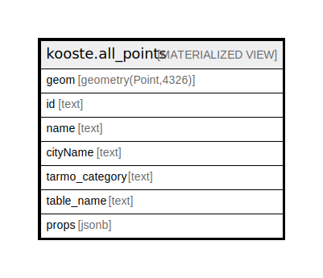

# kooste.all_points

## Description

<details>
<summary><strong>Table Definition</strong></summary>

```sql
CREATE MATERIALIZED VIEW all_points AS (
 SELECT (st_geometryn(points.geom, 1))::geometry(Point,4326) AS geom,
    concat('lipas_pisteet-', points."sportsPlaceId") AS id,
    points.name,
    points."cityName",
    points.tarmo_category,
    'lipas_pisteet'::text AS table_name,
    (row_to_json(points.*))::jsonb AS props
   FROM kooste.lipas_pisteet points
  WHERE (points.deleted = false)
UNION ALL
 SELECT (st_geometryn(points.geom, 1))::geometry(Point,4326) AS geom,
    concat('museovirastoarcrest_rkykohteet-', points."OBJECTID") AS id,
    points.name,
    'Tampere'::text AS "cityName",
    points.tarmo_category,
    'museovirastoarcrest_rkykohteet'::text AS table_name,
    (row_to_json(points.*))::jsonb AS props
   FROM kooste.museovirastoarcrest_rkykohteet points
  WHERE ((points.deleted = false) AND (points.visibility = true))
UNION ALL
 SELECT (st_geometryn(points.geom, 1))::geometry(Point,4326) AS geom,
    concat('museovirastoarcrest_muinaisjaannokset-', points.mjtunnus) AS id,
    points.name,
    points."cityName",
    points.tarmo_category,
    'museovirastoarcrest_muinaisjaannokset'::text AS table_name,
    (row_to_json(points.*))::jsonb AS props
   FROM kooste.museovirastoarcrest_muinaisjaannokset points
  WHERE ((points.deleted = false) AND (points.visibility = true))
UNION ALL
 SELECT (st_geometryn(points.geom, 1))::geometry(Point,4326) AS geom,
    concat('tamperewfs_luonnonmuistomerkit-', points.sw_member) AS id,
    points.name,
    'Tampere'::text AS "cityName",
    points.tarmo_category,
    'tamperewfs_luonnonmuistomerkit'::text AS table_name,
    (row_to_json(points.*))::jsonb AS props
   FROM kooste.tamperewfs_luonnonmuistomerkit points
  WHERE ((points.deleted = false) AND (points.visibility = true))
UNION ALL
 SELECT (st_geometryn(points.geom, 1))::geometry(Point,4326) AS geom,
    concat('tamperewfs_luontopolkurastit-', points.mi_prinx) AS id,
    points.name,
    'Tampere'::text AS "cityName",
    points.tarmo_category,
    'tamperewfs_luontopolkurastit'::text AS table_name,
    (row_to_json(points.*))::jsonb AS props
   FROM kooste.tamperewfs_luontopolkurastit points
  WHERE ((points.deleted = false) AND (points.visibility = true))
)
```

</details>

## Referenced Tables

- [kooste.lipas_pisteet](kooste.lipas_pisteet.md)
- [kooste.museovirastoarcrest_rkykohteet](kooste.museovirastoarcrest_rkykohteet.md)
- [kooste.museovirastoarcrest_muinaisjaannokset](kooste.museovirastoarcrest_muinaisjaannokset.md)
- [kooste.tamperewfs_luonnonmuistomerkit](kooste.tamperewfs_luonnonmuistomerkit.md)
- [kooste.tamperewfs_luontopolkurastit](kooste.tamperewfs_luontopolkurastit.md)

## Columns

| Name | Type | Default | Nullable | Children | Parents | Comment |
| ---- | ---- | ------- | -------- | -------- | ------- | ------- |
| geom | geometry(Point,4326) |  | true |  |  |  |
| id | text |  | true |  |  |  |
| name | text |  | true |  |  |  |
| cityName | text |  | true |  |  |  |
| tarmo_category | text |  | true |  |  |  |
| table_name | text |  | true |  |  |  |
| props | jsonb |  | true |  |  |  |

## Indexes

| Name | Definition |
| ---- | ---------- |
| all_points_id_idx | CREATE INDEX all_points_id_idx ON kooste.all_points USING btree (id) |
| all_points_name_idx | CREATE INDEX all_points_name_idx ON kooste.all_points USING gin (name gin_trgm_ops) |
| all_points_cityName_idx | CREATE INDEX "all_points_cityName_idx" ON kooste.all_points USING btree ("cityName") |
| all_points_tarmo_category_idx | CREATE INDEX all_points_tarmo_category_idx ON kooste.all_points USING btree (tarmo_category) |

## Relations



---

> Generated by [tbls](https://github.com/k1LoW/tbls)
