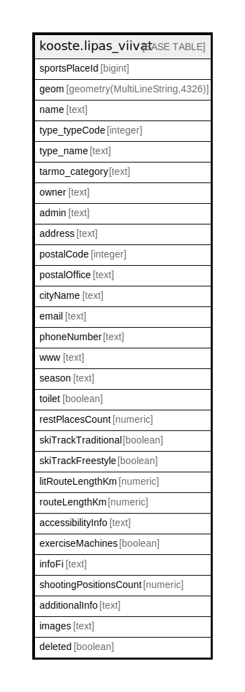

# kooste.lipas_viivat

## Description

## Columns

| Name | Type | Default | Nullable | Children | Parents | Comment |
| ---- | ---- | ------- | -------- | -------- | ------- | ------- |
| sportsPlaceId | bigint |  | false |  |  |  |
| geom | geometry(MultiLineString,4326) |  | false |  |  |  |
| name | text |  | false |  |  |  |
| type_typeCode | integer |  | false |  |  |  |
| type_name | text |  | false |  |  |  |
| tarmo_category | text |  | true |  |  |  |
| owner | text |  | true |  |  |  |
| admin | text |  | true |  |  |  |
| address | text |  | true |  |  |  |
| postalCode | integer |  | true |  |  |  |
| postalOffice | text |  | true |  |  |  |
| cityName | text |  | true |  |  |  |
| email | text |  | true |  |  |  |
| phoneNumber | text |  | true |  |  |  |
| www | text |  | true |  |  |  |
| season | text |  | false |  |  |  |
| toilet | boolean |  | true |  |  |  |
| restPlacesCount | numeric |  | true |  |  |  |
| skiTrackTraditional | boolean |  | true |  |  |  |
| skiTrackFreestyle | boolean |  | true |  |  |  |
| litRouteLengthKm | numeric |  | true |  |  |  |
| routeLengthKm | numeric |  | true |  |  |  |
| accessibilityInfo | text |  | true |  |  |  |
| exerciseMachines | boolean |  | true |  |  |  |
| infoFi | text |  | true |  |  |  |
| shootingPositionsCount | numeric |  | true |  |  |  |
| additionalInfo | text |  | true |  |  |  |
| images | text |  | true |  |  |  |
| deleted | boolean | false | false |  |  |  |

## Constraints

| Name | Type | Definition |
| ---- | ---- | ---------- |
| lipas_viivat_pk | PRIMARY KEY | PRIMARY KEY ("sportsPlaceId") |

## Indexes

| Name | Definition |
| ---- | ---------- |
| lipas_viivat_pk | CREATE UNIQUE INDEX lipas_viivat_pk ON kooste.lipas_viivat USING btree ("sportsPlaceId") |
| lipas_viivat_deleted_idx | CREATE INDEX lipas_viivat_deleted_idx ON kooste.lipas_viivat USING btree (deleted) |
| lipas_viivat_tarmo_category_idx | CREATE INDEX lipas_viivat_tarmo_category_idx ON kooste.lipas_viivat USING btree (tarmo_category) |
| lipas_viivat_cityname_idx | CREATE INDEX lipas_viivat_cityname_idx ON kooste.lipas_viivat USING btree ("cityName") |

## Relations

---

> Generated by [tbls](https://github.com/k1LoW/tbls)
