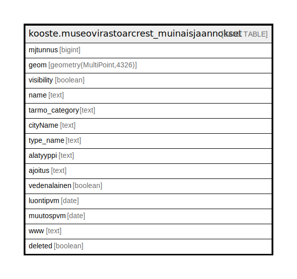

# kooste.museovirastoarcrest_muinaisjaannokset

## Description

## Columns

| Name | Type | Default | Nullable | Children | Parents | Comment |
| ---- | ---- | ------- | -------- | -------- | ------- | ------- |
| mjtunnus | bigint |  | false |  |  |  |
| geom | geometry(MultiPoint,4326) |  | false |  |  |  |
| visibility | boolean | true | true |  |  |  |
| name | text |  | false |  |  |  |
| tarmo_category | text | 'Muinaisjäännökset'::text | true |  |  |  |
| cityName | text |  | true |  |  |  |
| type_name | text | 'Muinaisjäännös'::text | true |  |  |  |
| alatyyppi | text |  | true |  |  |  |
| ajoitus | text |  | true |  |  |  |
| vedenalainen | boolean |  | true |  |  |  |
| luontipvm | date |  | true |  |  |  |
| muutospvm | date |  | true |  |  |  |
| www | text |  | true |  |  |  |
| deleted | boolean | false | false |  |  |  |

## Constraints

| Name | Type | Definition |
| ---- | ---- | ---------- |
| museovirastoarcrest_muinaisjaannokset_pk | PRIMARY KEY | PRIMARY KEY (mjtunnus) |

## Indexes

| Name | Definition |
| ---- | ---------- |
| museovirastoarcrest_muinaisjaannokset_pk | CREATE UNIQUE INDEX museovirastoarcrest_muinaisjaannokset_pk ON kooste.museovirastoarcrest_muinaisjaannokset USING btree (mjtunnus) |
| museovirastoarcrest_muinaisjaannokset_deleted_idx | CREATE INDEX museovirastoarcrest_muinaisjaannokset_deleted_idx ON kooste.museovirastoarcrest_muinaisjaannokset USING btree (deleted) |
| museovirastoarcrest_muinaisjaannokset_tarmo_category_idx | CREATE INDEX museovirastoarcrest_muinaisjaannokset_tarmo_category_idx ON kooste.museovirastoarcrest_muinaisjaannokset USING btree (tarmo_category) |
| museovirastoarcrest_muinaisjaannokset_visibility_idx | CREATE INDEX museovirastoarcrest_muinaisjaannokset_visibility_idx ON kooste.museovirastoarcrest_muinaisjaannokset USING btree (visibility) |
| museovirastoarcrest_muinaisjaannokset_cityname_idx | CREATE INDEX museovirastoarcrest_muinaisjaannokset_cityname_idx ON kooste.museovirastoarcrest_muinaisjaannokset USING btree ("cityName") |

## Relations

---

> Generated by [tbls](https://github.com/k1LoW/tbls)
