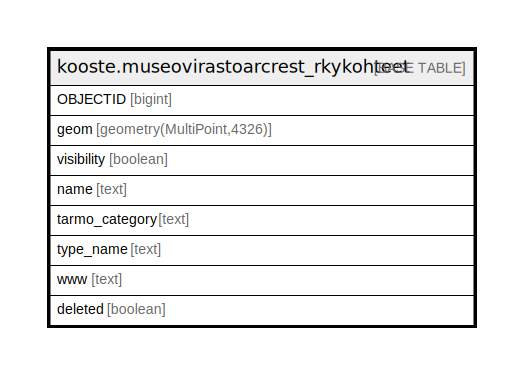

# kooste.museovirastoarcrest_rkykohteet

## Description

## Columns

| Name | Type | Default | Nullable | Children | Parents | Comment |
| ---- | ---- | ------- | -------- | -------- | ------- | ------- |
| OBJECTID | bigint |  | false |  |  |  |
| geom | geometry(MultiPoint,4326) |  | false |  |  |  |
| visibility | boolean | true | true |  |  |  |
| name | text |  | false |  |  |  |
| tarmo_category | text | 'Nähtävyydet'::text | true |  |  |  |
| type_name | text | 'Rakennettu kulttuurikohde'::text | true |  |  |  |
| www | text |  | true |  |  |  |
| deleted | boolean | false | false |  |  |  |

## Constraints

| Name | Type | Definition |
| ---- | ---- | ---------- |
| museovirastoarcrest_rkykohteet_pk | PRIMARY KEY | PRIMARY KEY ("OBJECTID") |

## Indexes

| Name | Definition |
| ---- | ---------- |
| museovirastoarcrest_rkykohteet_pk | CREATE UNIQUE INDEX museovirastoarcrest_rkykohteet_pk ON kooste.museovirastoarcrest_rkykohteet USING btree ("OBJECTID") |
| museovirastoarcrest_rkykohteet_deleted_idx | CREATE INDEX museovirastoarcrest_rkykohteet_deleted_idx ON kooste.museovirastoarcrest_rkykohteet USING btree (deleted) |
| museovirastoarcrest_rkykohteet_tarmo_category_idx | CREATE INDEX museovirastoarcrest_rkykohteet_tarmo_category_idx ON kooste.museovirastoarcrest_rkykohteet USING btree (tarmo_category) |
| museovirastoarcrest_rkykohteet_visibility_idx | CREATE INDEX museovirastoarcrest_rkykohteet_visibility_idx ON kooste.museovirastoarcrest_rkykohteet USING btree (visibility) |

## Relations

---

> Generated by [tbls](https://github.com/k1LoW/tbls)
