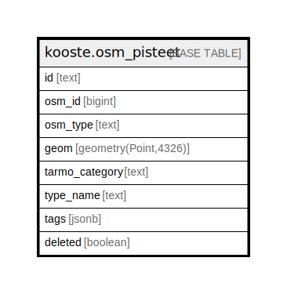

# kooste.osm_pisteet

## Description

## Columns

| Name | Type | Default | Nullable | Children | Parents | Comment |
| ---- | ---- | ------- | -------- | -------- | ------- | ------- |
| id | text |  | false |  |  |  |
| osm_id | bigint |  | false |  |  |  |
| osm_type | text |  | false |  |  |  |
| geom | geometry(Point,4326) |  | false |  |  |  |
| tarmo_category | text | 'Pysäköinti'::text | true |  |  |  |
| type_name | text | 'Pysäköintipaikka'::text | true |  |  |  |
| tags | jsonb |  | true |  |  |  |
| deleted | boolean | false | false |  |  |  |

## Constraints

| Name | Type | Definition |
| ---- | ---- | ---------- |
| osm_pisteet_pk | PRIMARY KEY | PRIMARY KEY (id) |
| osm_pisteet_osm_id_osm_type_key | UNIQUE | UNIQUE (osm_id, osm_type) |

## Indexes

| Name | Definition |
| ---- | ---------- |
| osm_pisteet_pk | CREATE UNIQUE INDEX osm_pisteet_pk ON kooste.osm_pisteet USING btree (id) |
| osm_pisteet_osm_id_osm_type_key | CREATE UNIQUE INDEX osm_pisteet_osm_id_osm_type_key ON kooste.osm_pisteet USING btree (osm_id, osm_type) |
| osm_pisteet_deleted_idx | CREATE INDEX osm_pisteet_deleted_idx ON kooste.osm_pisteet USING btree (deleted) |
| osm_pisteet_tarmo_category_idx | CREATE INDEX osm_pisteet_tarmo_category_idx ON kooste.osm_pisteet USING btree (tarmo_category) |

## Relations

---

> Generated by [tbls](https://github.com/k1LoW/tbls)
