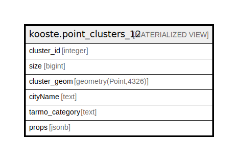

# kooste.point_clusters_12

## Description

<details>
<summary><strong>Table Definition</strong></summary>

```sql
CREATE MATERIALIZED VIEW point_clusters_12 AS (
 SELECT get_clusters.cluster_id,
    get_clusters.size,
    (st_setsrid(get_clusters.cluster_geom, 4326))::geometry(Point,4326) AS cluster_geom,
    get_clusters."cityName",
    get_clusters.tarmo_category,
    get_clusters.props
   FROM kooste.get_clusters((0.007)::double precision) get_clusters(cluster_id, size, cluster_geom, "cityName", tarmo_category, props)
)
```

</details>

## Referenced Tables

- kooste.get_clusters

## Columns

| Name | Type | Default | Nullable | Children | Parents | Comment |
| ---- | ---- | ------- | -------- | -------- | ------- | ------- |
| cluster_id | integer |  | true |  |  |  |
| size | bigint |  | true |  |  |  |
| cluster_geom | geometry(Point,4326) |  | true |  |  |  |
| cityName | text |  | true |  |  |  |
| tarmo_category | text |  | true |  |  |  |
| props | jsonb |  | true |  |  |  |

## Indexes

| Name | Definition |
| ---- | ---------- |
| point_clusters_12_cityName_idx | CREATE INDEX "point_clusters_12_cityName_idx" ON kooste.point_clusters_12 USING btree ("cityName") |

## Relations



---

> Generated by [tbls](https://github.com/k1LoW/tbls)
