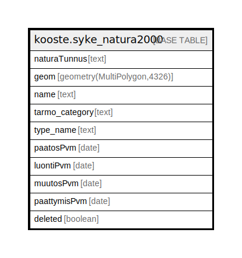

# kooste.syke_natura2000

## Description

## Columns

| Name | Type | Default | Nullable | Children | Parents | Comment |
| ---- | ---- | ------- | -------- | -------- | ------- | ------- |
| naturaTunnus | text |  | false |  |  |  |
| geom | geometry(MultiPolygon,4326) |  | false |  |  |  |
| name | text |  | false |  |  |  |
| tarmo_category | text | 'Tausta-aineistot'::text | true |  |  |  |
| type_name | text | 'Natura-alue'::text | true |  |  |  |
| paatosPvm | date |  | true |  |  |  |
| luontiPvm | date |  | true |  |  |  |
| muutosPvm | date |  | true |  |  |  |
| paattymisPvm | date |  | true |  |  |  |
| deleted | boolean | false | false |  |  |  |

## Constraints

| Name | Type | Definition |
| ---- | ---- | ---------- |
| syke_natura2000_pk | PRIMARY KEY | PRIMARY KEY ("naturaTunnus") |

## Indexes

| Name | Definition |
| ---- | ---------- |
| syke_natura2000_pk | CREATE UNIQUE INDEX syke_natura2000_pk ON kooste.syke_natura2000 USING btree ("naturaTunnus") |
| syke_natura2000_deleted_idx | CREATE INDEX syke_natura2000_deleted_idx ON kooste.syke_natura2000 USING btree (deleted) |

## Relations

---

> Generated by [tbls](https://github.com/k1LoW/tbls)
