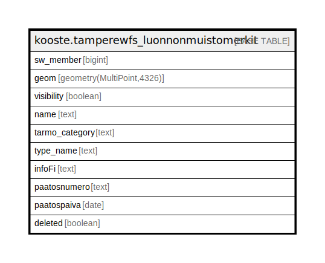

# kooste.tamperewfs_luonnonmuistomerkit

## Description

## Columns

| Name | Type | Default | Nullable | Children | Parents | Comment |
| ---- | ---- | ------- | -------- | -------- | ------- | ------- |
| sw_member | bigint |  | false |  |  |  |
| geom | geometry(MultiPoint,4326) |  | false |  |  |  |
| visibility | boolean | true | true |  |  |  |
| name | text |  | false |  |  |  |
| tarmo_category | text | 'Nähtävyydet'::text | true |  |  |  |
| type_name | text | 'Luonnonmuistomerkki'::text | true |  |  |  |
| infoFi | text |  | true |  |  |  |
| paatosnumero | text |  | true |  |  |  |
| paatospaiva | date |  | true |  |  |  |
| deleted | boolean | false | false |  |  |  |

## Constraints

| Name | Type | Definition |
| ---- | ---- | ---------- |
| tamperewfs_luonnonmuistomerkit_pk | PRIMARY KEY | PRIMARY KEY (sw_member) |

## Indexes

| Name | Definition |
| ---- | ---------- |
| tamperewfs_luonnonmuistomerkit_pk | CREATE UNIQUE INDEX tamperewfs_luonnonmuistomerkit_pk ON kooste.tamperewfs_luonnonmuistomerkit USING btree (sw_member) |
| tamperewfs_luonnonmuistomerkit_deleted_idx | CREATE INDEX tamperewfs_luonnonmuistomerkit_deleted_idx ON kooste.tamperewfs_luonnonmuistomerkit USING btree (deleted) |
| tamperewfs_luonnonmuistomerkit_tarmo_category_idx | CREATE INDEX tamperewfs_luonnonmuistomerkit_tarmo_category_idx ON kooste.tamperewfs_luonnonmuistomerkit USING btree (tarmo_category) |
| tamperewfs_luonnonmuistomerkit_visibility_idx | CREATE INDEX tamperewfs_luonnonmuistomerkit_visibility_idx ON kooste.tamperewfs_luonnonmuistomerkit USING btree (visibility) |

## Relations

---

> Generated by [tbls](https://github.com/k1LoW/tbls)
