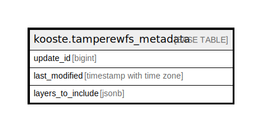

# kooste.tamperewfs_metadata

## Description

## Columns

| Name | Type | Default | Nullable | Children | Parents | Comment |
| ---- | ---- | ------- | -------- | -------- | ------- | ------- |
| update_id | bigint |  | false |  |  |  |
| last_modified | timestamp with time zone |  | true |  |  |  |
| layers_to_include | jsonb |  | true |  |  |  |

## Constraints

| Name | Type | Definition |
| ---- | ---- | ---------- |
| tamperewfs_metadata_pk | PRIMARY KEY | PRIMARY KEY (update_id) |

## Indexes

| Name | Definition |
| ---- | ---------- |
| tamperewfs_metadata_pk | CREATE UNIQUE INDEX tamperewfs_metadata_pk ON kooste.tamperewfs_metadata USING btree (update_id) |

## Relations

---

> Generated by [tbls](https://github.com/k1LoW/tbls)
